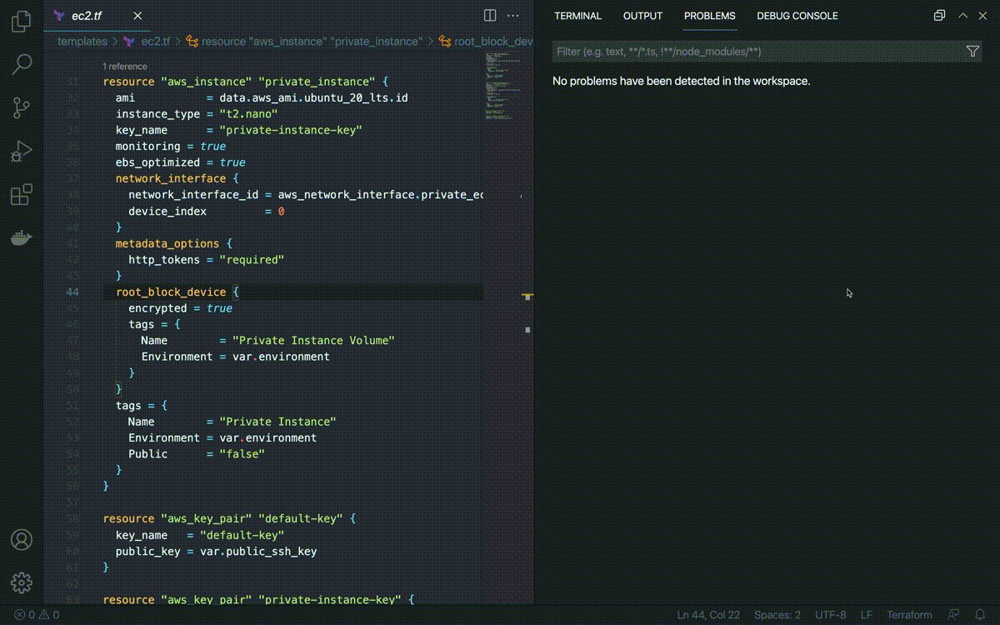

# Cloudrail Visual Studio Code Extension
[Cloudrail](https://cloudrail.app) is an infrastructure as code scanning tool that scans your terraform code for security vulnerabilities and best practices.

## Getting Started
To get started with the Cloudrail Visual Studio Code extension, first make sure you've set up your Cloudrail account. It's a quick and free process, with [instructions found here on how to do it](https://docs.cloudrail.app/#/getting-started/account-setup).

Once your account has been setup, follow these instructions:

1. Search for Cloudrail in the Visual Studio Code Marketplace and install it to your workspace.
2. Reload your workspace if instructed.
3. If you don't yet have the cloudrail command line tool installed, retrieve your Cloudrail API key from the [Cloudrail web console](https://web.cloudrail.app). Otherwise, skip this step.
4. Open Visual Studio Code to your desired terraform project.
5. Open the command palette with `Ctrl + Shift + P` or `Command + Shift + P` on OSX, and type `Cloudrail` to see all available Cloudrail commands.
6. Select `Cloudrail Settings` to bring up the settings page.
7. If you have not installed the cloudrail command line tool, fill in the Cloudrail API key, otherwise skip this step (your API key from the command line tool will be used).
8. Fill in any other desired settings.
9. Open the command menu again, and select `Cloudrail Scan` to run an assessment on your infrastructure as code.

### Running A Scan
To run a simple static scan, choose the `Cloudrail Scan` command from your command palette (`Ctrl + Shift + P`). 

### Using A Custom Policy
To apply custom rules with a custom policy, add the policy ID to the Cloudrail Settings tab. 

## Available Commands
The following commands are available from the command palette.
* Cloudrail Scan
    * Performs a static scan on terraform files in the specified directory
* Cloudrail Settings
    * Adjust Cloudrail settings for a particular project
* Cloudrail Update
    * Updates to the latest version of Cloudrail
* Cloudrail Version
    * Displays the current version of Cloudrail and the Cloudrail VS Code Extensiion
* Cloudrail Init
    * Sets up Cloudrail for a particular project

## Notes

### Supported languages
Terraform

### Determining Scan Directory
The Cloudrail extension will attempt to determine the correct directory to scan based on the current file open in your editor. If you have `main.tf` open, and `variables.tf` is in the same directory, cloudrail will scan `main.tf`, `variables.tf`, and any other `.tf` file in that directory. If you choose to open a different file in a different directory, that file, and any related files to it will be scanned.

## Cloudrail in a Nutshell
### Discover, Detect, and Control

Your cloud infrastructure is built, managed, and deployed using automation. Your security framework should discover potentially new infrastructure, detect security issues, and allow you to control what gets deployed.

### Policy-as-Code

Your policy requirements should not be stuck in spreadsheets. Empower your team with continuous security attestation.
### Cloud Security the DevOps Way

Fixing cloud security after deployment is time consuming and requires a lot of effort. Detect cloud security issues early in the development process. Treat security violations as simple code fixes.

## Feedback
Have feedback? [Send us an email at community@cloudrail.app](mailto:community@cloudrail.app)